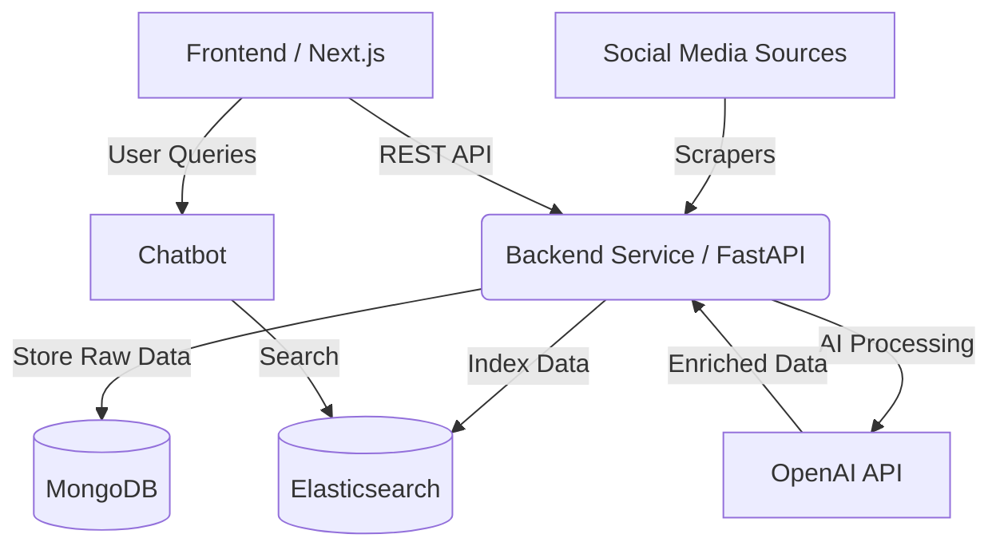

# DisasterLens
### Real-time Disaster Monitoring & AI Analysis Platform

DisasterLens is a comprehensive situational awareness tool designed to scrape, analyze, and visualize disaster-related data from social media platforms (Instagram, Twitter/X) in real time. By leveraging Generative AI and sentiment analysis, it transforms raw social chatter into actionable intelligence for disaster response and monitoring.

---

## 🚀 Key Features

- **Multi-Source Data Scraping**  
  Automated, asynchronous scrapers for Instagram and Twitter/X to detect emerging disaster events.

- **AI-Powered Classification**  
  Utilizes LLMs (OpenAI) to classify incidents (e.g., *Fire*, *Flood*, *Earthquake*) and extract critical location data.

- **Sentiment Analysis**  
  Analyzes public sentiment to gauge severity and emotional response to disaster events.

- **Interactive Dashboard**  
  Responsive Next.js frontend with a dynamic Leaflet map for visualizing disaster locations and statistics.

- **Intelligent Chatbot**  
  Integrated RAG (Retrieval-Augmented Generation) chatbot for natural-language querying of disaster data.

- **Full-Text Search**  
  Powered by Elasticsearch for fast and scalable information retrieval.

---
## 📼 Demo

---

## 🛠️ Tech Stack

### Frontend
- **Framework:** Next.js 14 (App Router)
- **Language:** TypeScript
- **Styling:** Tailwind CSS (shadcn/ui compatible)
- **Maps:** Leaflet (`react-leaflet`)
- **State Management:** React Hooks

### Backend
- **Framework:** FastAPI (Python)
- **Database:** MongoDB (primary store)
- **Search Engine:** Elasticsearch
- **AI/ML:** OpenAI API (GPT-4 / GPT-3.5)
- **Data Processing:** Pandas, Asyncio

### DevOps
- **Containerization:** Docker & Docker Compose
- **CI/CD:** GitHub Actions (scraper workflows included)

---

## 🏗️ Architecture


---
## ⚡ Getting Started
### Prerequisites
Ensure you have the following installed:
- Docker & Docker Compose (recommended)
- Node.js v18+ and npm/pnpm (for local frontend)
- Python 3.10+ (for local backend)

### 📥 Installation
#### Clone the Repository
```bash
git clone https://github.com/rachelfong0320/disasterlens.git
cd disasterlens`
```
#### Environment Setup
Create a `.env` file in the `backend/` directory:
```bash
OPENAI_API_KEY=your_openai_key
MONGO_URI=mongodb://mongo:27017/disasterlens
ELASTICSEARCH_URL=http://elasticsearch:9200
INSTAGRAM_USERNAME=your_mongodb_username
INSTAGRAM_PASSWORD=your_mongodb_password
```

#### ▶️ Run with Docker Compose (Recommended)
``` bash
docker-compose up --build
```

- Frontend: http://localhost:3000
- Backend API Docs: http://localhost:8000/docs


#### 🔧 Manual Setup (Local Development)
**Backend**
```bash
cd backend
python -m venv venv
source venv/bin/activate  # Windows: venv\Scripts\activate
pip install -r requirements.txt
uvicorn app.main:app --reload
```

**Frontend**
```bash
cd frontend
npm install
npm run dev
```
--- 
## 📂 Project Structure
```bash
disasterlens/
├── backend/
│   ├── app/                 # API Routes, Models, and Services
│   │   ├── chatbot/         # Chatbot logic and Elasticsearch integration
│   │   └── routes/          # FastAPI endpoints
│   ├── core/                # Core business logic
│   │   ├── jobs/            # AI jobs (Sentiment, Classification)
│   │   └── scrapers/        # Instagram & Tweet scrapers
│   └── Dockerfile
├── frontend/
│   ├── app/                 # Next.js App Router pages
│   ├── components/          # Reusable UI components & Map widgets
│   └── hooks/               # Custom React hooks
├── docker-compose.yml       # Orchestration for the full stack
└── README.md
```
---
## 👥 Team

Developed by Rachel Fong and Ng Yong Jing.

  <a href="https://github.com/rachelfong0320">
    
  </a>
   <a href="https://github.com/yongjing479">
    
  </a>

---
> ⚠️ Disclaimer: 
> This project is intended for educational and research purposes.
> Ensure compliance with the Terms of Service of any social media platforms used for data scraping.

