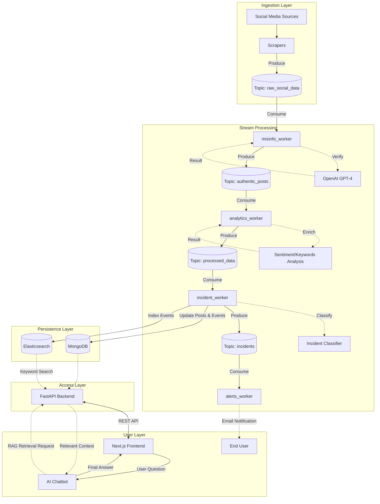

# DisasterLens
### Real-time Disaster Monitoring & AI Analysis Platform

DisasterLens is a comprehensive situational awareness tool designed to scrape, analyze, and visualize disaster-related data from social media platforms (Instagram, Twitter/X) in real time. By leveraging Generative AI and sentiment analysis, it transforms raw social chatter into actionable intelligence for disaster response and monitoring.

---

## 🚀 Key Features

- **Multi-Source Data Scraping**  
  Automated, asynchronous scrapers for Instagram and Twitter/X to detect emerging disaster events.

- **AI-Powered Classification**  
  Utilizes LLMs (OpenAI) to classify incidents (e.g., *Fire*, *Flood*, *Earthquake*) and extract critical location data.

- **Sentiment Analysis**  
  Analyzes public sentiment to gauge severity and emotional response to disaster events.

- **Interactive Dashboard**  
  Responsive Next.js frontend with a dynamic Leaflet map for visualizing disaster locations and statistics.

- **Intelligent Chatbot**  
  Integrated RAG (Retrieval-Augmented Generation) chatbot for natural-language querying of disaster data.

- **Full-Text Search**  
  Powered by Elasticsearch for fast and scalable information retrieval.

---
## 📼 Demo

---

## 🛠️ Tech Stack

### Frontend
- **Framework:** Next.js 14 (App Router)
- **Language:** TypeScript
- **Styling:** Tailwind CSS (shadcn/ui compatible)
- **Maps:** Leaflet (`react-leaflet`)
- **State Management:** React Hooks

### Backend
- **Framework:** FastAPI (Python)
- **Database:** MongoDB (primary store)
- **Search Engine:** Elasticsearch
- **AI/ML:** OpenAI API (GPT-4 / GPT-3.5)
- **Data Processing:** Pandas, Asyncio

### DevOps
- **Containerization:** Docker & Docker Compose
- **CI/CD:** GitHub Actions (scraper workflows included)

---

## 🏗️ Architecture


---
## ⚡ Getting Started
### Prerequisites
Ensure you have the following installed:
- Docker & Docker Compose (recommended)
- Node.js v18+ and npm/pnpm (for local frontend)
- Python 3.10+ (for local backend)

### 📥 Installation
#### Clone the Repository
```bash
git clone https://github.com/rachelfong0320/disasterlens.git
cd disasterlens`
```
#### Environment Setup
1. Create a `.env` file in the `backend/` directory:
```bash
# AI & Geocoding Services
IG_OPENAI_API_KEY=your_openai_api_key
OPEN_CAGE_KEY=your_opencage_api_key

# Database (MongoDB Atlas)
MONGO_USERNAME=your_mongodb_username
MONGO_PASSWORD=your_mongodb_password

# Kafka Configuration
KAFKA_BOOTSTRAP_SERVER=your_kafka_broker_url

# Twitter/X Scraper (RapidAPI)
RAPIDAPI_KEY=your_rapidapi_key
RAPIDAPI_HOST=twitter241.p.rapidapi.com

# Instagram Scraper (RapidAPI)
RAPIDAPI_IG_KEY=your_rapidapi_key
RAPID_API_IG_HOST=instagram-social-api.p.rapidapi.com
```
2. Create a `.env` file in the `frontend/` directory:
```bash
I18NEXUS_API_KEY=your_i18nexus_api_key
```

#### ▶️ Run with Docker Compose (Recommended)
``` bash
docker-compose up --build
```

- Frontend: http://localhost:3000
- Backend API Docs: http://localhost:8000/docs


#### 🔧 Manual Setup (Local Development)
**Backend**
```bash
cd backend
python -m venv venv
source venv/bin/activate  # Windows: venv\Scripts\activate
pip install -r requirements.txt
uvicorn app.main:app --reload
```

**Frontend**
```bash
cd frontend
npm install
npm run dev
```
--- 
## 📂 Project Structure
```bash
disasterlens/
├── .github/
│   └── workflows/           # CI/CD pipelines (Instagram & Tweet scrapers)
├── backend/
│   ├── app/                 # FastAPI Application
│   │   ├── chatbot/         # RAG Chatbot logic & Elasticsearch manual sync 
│   │   ├── db/              # Database connection handling
│   │   ├── models/          # Pydantic data models
│   │   ├── routes/          # API Endpoints (Alerts, Chatbot, Pipelines)
│   │   └── main.py          # App entry point
│   ├── core/                # Business Logic & Background Workers
│   │   ├── consumers/       # Kafka Consumers (Alerts, Analytics, Incident, Misinfo)
│   │   ├── jobs/            # AI Processing Jobs (Geo, Incident, Sentiment)
│   │   ├── processor/       # Event consolidation & Statistics aggregation
│   │   └── scrapers/        # Data collectors (Instagram & Twitter)
│   ├── tests/               # Test Suite (Integration, System, Unit)
│   ├── Dockerfile.api       # Dockerfile for the Main API
│   ├── Dockerfile.worker    # Dockerfile for Kafka Workers
│   └── requirements.txt     # Python dependencies
├── frontend/
│   ├── app/                 # Next.js App Router
│   │   └── [locale]/        # Internationalized pages (Dashboard, Data Sources)
│   ├── components/          # React Components
│   │   ├── ui/              # Reusable UI elements (Buttons, Inputs, etc.)
│   │   └── ...              # Map, Charts, and Filter widgets
│   ├── hooks/               # Custom React Hooks (Mobile, Toasts, Reports)
│   ├── i18n/                # Internationalization configuration
│   ├── lib/                 # Utility functions and TypeScript types
│   ├── messages/            # Translation files (en.json, ms.json)
│   ├── public/              # Static assets and icons
│   ├── Dockerfile           # Frontend Dockerfile
│   └── package.json         # Node.js dependencies
├── docker-compose.yml       # Orchestration for Full Stack (App, Workers, DBs)
└── README.md
```
---
## 👥 Team

Developed by Rachel Fong and Ng Yong Jing.

  <a href="https://github.com/rachelfong0320">
    
  </a>
   <a href="https://github.com/yongjing479">
    
  </a>

---
> ⚠️ Disclaimer: 
> This project is intended for educational and research purposes.
> Ensure compliance with the Terms of Service of any social media platforms used for data scraping.

